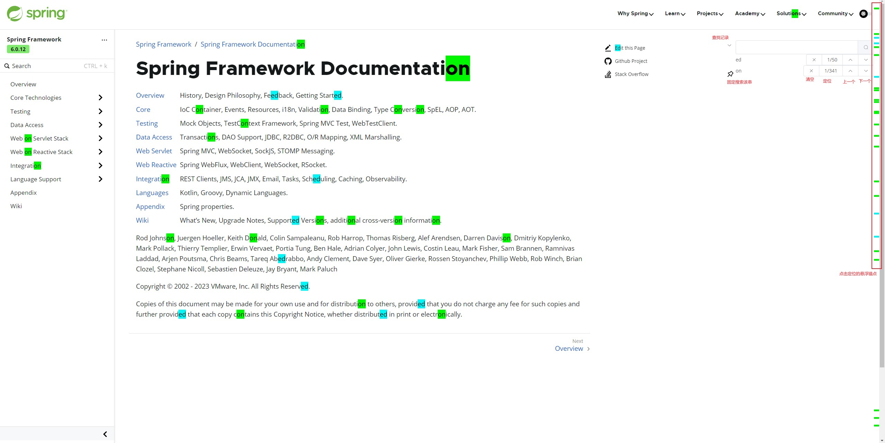

用于支持页面内搜索多个字符串，安装插件后打开页面按ctrl+q（可在插件快捷键页面配置，默认ctrl+q，如果ctrl+q被占用，需要配置一下 [chrome](chrome://extensions/shortcuts) or [edge](edge://extensions/shortcuts)）可见输入框

feature：

* 匹配多个字符串，不同颜色高亮
* 历史记录
* 可点击的锚点定位，定位到目标元素
* 固定查找的字符串（pin图标）
* 上一个，下一个，当前位置

